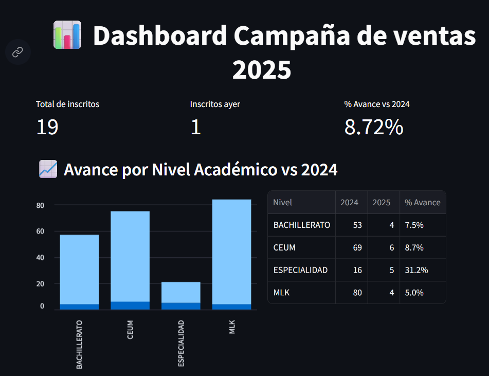
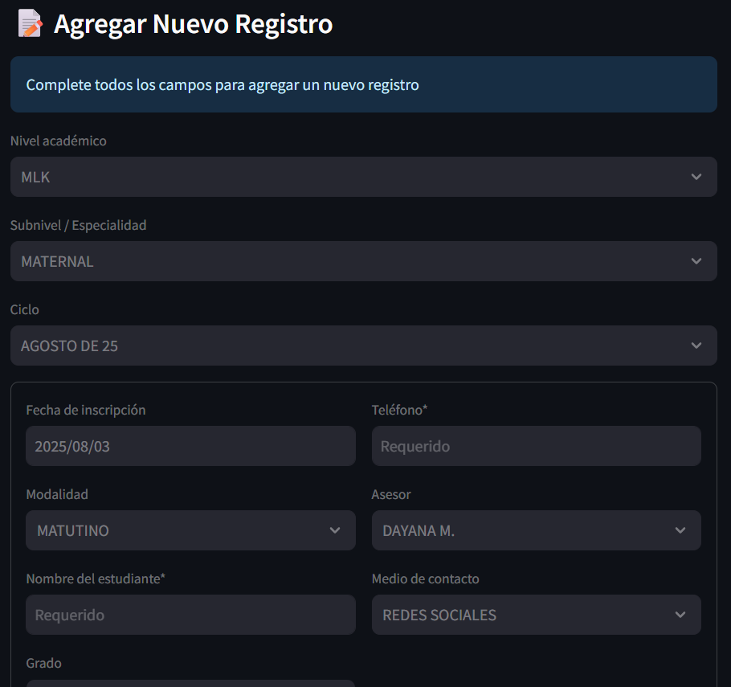

# Dashboard de Gestión de Inscripciones Académicas


Este proyecto es un dashboard interactivo desarrollado con **Streamlit** para gestionar y visualizar datos de inscripciones académicas. Proporciona métricas clave, gráficos de análisis y herramientas administrativas para el seguimiento de campañas de ventas educativas, con almacenamiento seguro en **Google Sheets**.

---

## ✨ Características principales

- 🔐 Autenticación segura de usuarios con roles y permisos  
- 📊 Visualización de métricas clave en tiempo real  
- 📈 Gráficos interactivos para análisis de datos  
- ✏️ Formulario para agregar nuevos registros  
- 📥 Exportación de datos en formato CSV  
- 👥 Gestión de diferentes niveles académicos y ciclos escolares  
- ☁️ Almacenamiento seguro en Google Sheets (no requiere base de datos local)  

---

## 📁 Estructura de archivos

```
.
├── venv/                   # Entorno virtual de Python
├── .streamlit/
│   └── secrets.toml        # Credenciales para Google Sheets
├── .gitignore              # Archivo para ignorar carpetas y archivos sensibles
├── app.py                  # Aplicación principal de Streamlit
├── config.yaml             # Configuración de usuarios y autenticación
├── Generar_hash.ipynb      # Notebook para generar hashes de contraseñas
├── generar_secrets.py      # Script para generar el archivo `secrets.toml`
└── requirements.txt        # Dependencias de Python
```

---

## ⚙️ Requisitos previos

- Python 3.8+
- pip (gestor de paquetes de Python)
- Cuenta de Google Cloud Platform (para acceder a Google Sheets API)

---

## 🚀 Instalación y configuración

### Clonar el repositorio:

```bash
git clone https://github.com/abgc757/dashboard_ventas_CECUM.git
cd dashboard-inscripciones
```

### Crear y activar entorno virtual:

```bash
python -m venv venv

# En Windows:
venv\Scripts\activate

# En Mac/Linux:
source venv/bin/activate
```

### Instalar dependencias:

```bash
pip install -r requirements.txt
```

### Configurar Google Sheets API:

1. Crear un proyecto en [Google Cloud Console](https://console.cloud.google.com/)
2. Habilitar la **Google Sheets API**
3. Crear una cuenta de servicio y descargar el archivo JSON de credenciales
4. Compartir tu hoja de cálculo con el correo de la cuenta de servicio

### Configurar `secrets.toml`:

1. Copiar las credenciales de la API en el directorio raiz del proyecto
2. Renombrarlo a `accesosDB.json`
3. Ejecutar el script
```bash
python generar_secrets.py
```

### Configurar usuarios:

- Edita `config.yaml` con tus usuarios y permisos
- Usa `Generar_hash.ipynb` para crear hashes de contraseñas

---

## ▶️ Uso

Inicia la aplicación:

```bash
streamlit run app.py
```

Abre tu navegador en:

```
http://localhost:8501
```

---

## 👤 Credenciales de ejemplo

| Usuario   | Contraseña   | Permisos             |
|-----------|--------------|----------------------|
| juanito   | abcdf123#$%  | Todos los permisos   |
| petronila | passworD1/#  | Todos los permisos   |
| jaimico   | usuario123$  | Solo visualización   |

---

## 🔒 Características de seguridad

- Autenticación con hash **bcrypt**
- Gestión de permisos por usuario
- Protección de credenciales con `secrets.toml`
- Acceso restringido a funciones administrativas
- Credenciales de Google almacenadas de forma segura

---

## 📑 Configuración de Google Sheets

1. Crea una nueva hoja en [Google Sheets](https://sheets.google.com)
2. Nombra la hoja como `"Datos Inscripciones"`
3. Usa la siguiente estructura de columnas:

```
NO | FECHA DE INSCRIPCION | SEMANA | FECHA DE INICIO CICLO ESCOLAR | MODALIDAD | ASESOR | NOMBRE | NIVEL | SUBNIVEL | GRADO | TURNO | TELEFONO | MEDIO POR EL CUAL SE ENTERO DE NOSOTROS | ANIO | MES
```

4. Comparte el documento con:

```
tu-email@tu-proyecto.iam.gserviceaccount.com
```

---

## ⚙️ Personalización

Puedes modificar:

- **Niveles académicos** → en el diccionario `subniveles` de `app.py`
- **Ciclos escolares** → en el diccionario `ciclos` de `app.py`
- **Permisos de usuario** → en `config.yaml`
- **Métricas** → en la sección de métricas en `app.py`
- **Nombre de la hoja de cálculo** → en la función `cargar_datos()`

---

## 🌐 Ventajas de usar Google Sheets

- ☁️ Almacenamiento en la nube sin servidores locales
- 🔄 Sincronización en tiempo real
- 📱 Acceso desde cualquier dispositivo
- 📊 Edición manual en una interfaz familiar
- 🔐 Permisos personalizados
- ⏱ Historial de cambios

---

## 📸 Capturas de pantalla

**Vista general del dashboard con métricas y gráficos**  


**Formulario para agregar nuevos registros**  


---

## 🤝 Contribución

¡Las contribuciones son bienvenidas!

1. Haz un fork del proyecto  
2. Crea una rama (`git checkout -b feature/nueva-funcionalidad`)  
3. Haz commit (`git commit -am 'Agrega nueva funcionalidad'`)  
4. Haz push (`git push origin feature/nueva-funcionalidad`)  
5. Abre un **Pull Request**

---

## 📝 Licencia

Este proyecto está bajo la licencia MIT. Consulta el archivo `LICENSE` para más detalles.

> **🔐 Nota de seguridad:** *Nunca subas tu archivo `secrets.toml` a un repositorio público. Ya está incluido en `.gitignore` para evitar filtraciones accidentales.*